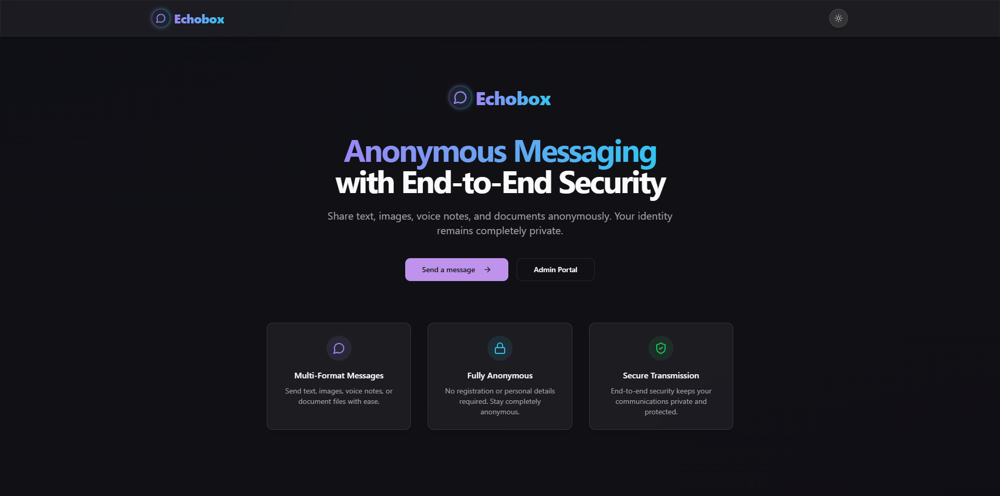

# Echobox - Anonymous Messaging Platform



## Overview

Echobox is a modern and secure anonymous messaging platform built with React, TypeScript, and Tailwind CSS. It provides an elegant, user-friendly interface for anonymous messaging with support for text, images, voice notes, and documents.

## Features

### General
- Dark/light theme toggle
- Responsive design (mobile-first approach)
- Smooth animations and transitions
- Glass morphism UI elements
- Gradient accents

### For Users
- **Anonymous Message Submission**
  - No authentication required
  - Support for multiple message formats:
    - Text (max 1000 characters)
    - Images (PNG, JPG, WEBP, max 5MB)
    - Voice notes (MP3, max 2 minutes)
    - Documents (PDF, DOC, max 10MB)
  - Real-time input validation
  - Voice recording directly in the platform
  - Form auto-cleanup after submission

### For Admins
- **Secure Admin Portal**
  - Authentication with hardcoded credentials
  - Session management
  - Rate limiting for login attempts

- **Message Dashboard**
  - Grid/List view toggle
  - Message filtering by type, date range, read/unread status
  - Infinite scroll pagination
  - Quick actions (mark as read, export to WhatsApp, screenshot capture, delete)
  - Message preview with modal expansion

## Tech Stack

- **Frontend Framework**: React with TypeScript
- **Styling**: Tailwind CSS + shadcn/ui components
- **Animations**: Framer Motion
- **Form Handling**: React Hook Form + Zod validation
- **UI Components**: shadcn/ui (built on Radix UI)
- **Routing**: React Router
- **Icons**: Lucide React

## Security Features

- Rate limiting
- Input sanitization
- File type validation
- XSS protection
- CSRF protection
- Secure file storage (backend implementation required)

## Getting Started

### Prerequisites

- Node.js (v16 or higher)
- npm or yarn

### Installation

1. Clone the repository
```bash
git clone https://github.com/Psybah/echobox.git
cd echobox
```

2. Install dependencies
```bash
npm install
# or
yarn
```

3. Start the development server
```bash
npm run dev
# or
yarn dev
```

4. The application will be available at `http://localhost:8080`

## Admin Access

To access the admin dashboard:
1. Navigate to `/admin`
2. Use the following credentials:
   - Username: `Admin`
   - Password: `IamAdmin$`

## Connecting to Backend

The frontend is designed to be easily connected to any backend implementation. To connect to your existing backend:

1. Configure API endpoints in a centralized service
2. Implement authentication logic in the `useAdmin` hook
3. Update form submission handlers to use your API endpoints
4. Implement file upload functionality with your backend storage solution

## Performance Optimizations

- Image optimization
- Lazy loading of components
- Code splitting
- API route optimization (when connected to backend)
- Caching strategy

## Project Structure

```
src/
├── components/           # Reusable UI components
│   ├── admin/            # Admin-specific components
│   ├── auth/             # Authentication components
│   ├── file-upload/      # File upload components
│   ├── layout/           # Layout components (header, footer, etc.)
│   ├── message/          # Message-related components
│   └── ui/               # shadcn/ui components
├── hooks/                # Custom React hooks
├── lib/                  # Utility functions and helpers
├── pages/                # Page components
└── App.tsx               # Main application component with routing
```

## Contributing

Contributions are welcome! Please feel free to submit a Pull Request.

## License

This project is licensed under the MIT License - see the LICENSE file for details.

## Acknowledgements

- [shadcn/ui](https://ui.shadcn.com/) for the beautiful UI components
- [Tailwind CSS](https://tailwindcss.com/) for styling
- [Framer Motion](https://www.framer.com/motion/) for animations
- [Lucide Icons](https://lucide.dev/) for icons

---

Made with ❤️ by [Cybersmith](https://github.com/Psybah/)
